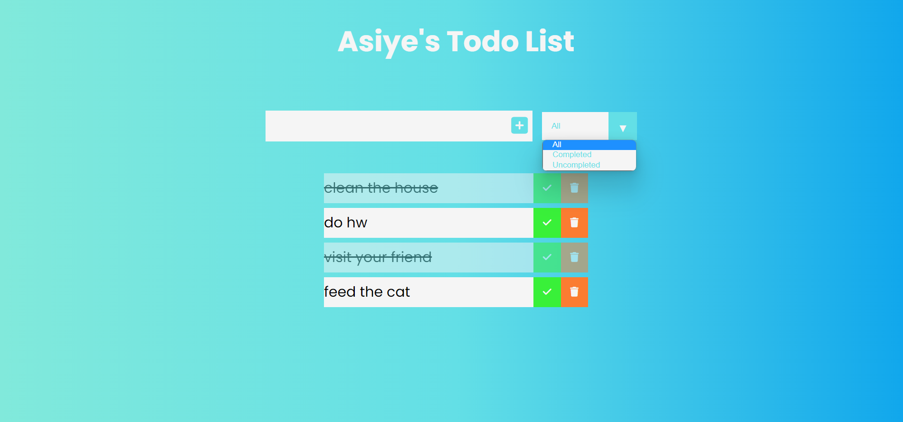

# Todo List

---

## How does ToDo list be used?

ToDo List Checks to see if plans are made.



---

## Demo

Here is a working live demo : [Demo](https://asiyegokalp.github.io/TodoList/)

---

## ES6 + Features

- Arrow Functions
- Modules export/import
- localStorage

---

## Structure

```
├── images
│   └── ph1.png
│
├── public
│   └── style.css
├── src
│   ├── page
│   │     ├── deleteCheck.js
│   │     ├── filterTodo.js
│   │     └── localStorage.js
│   └── view
│         ├──generateAddTodo.js
│         └──generateTodoList.js
├── app.js
├── index.html
└── README.md

```
